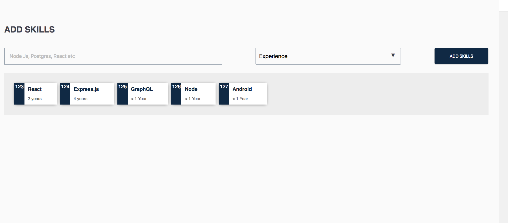

## README file Instructions

- How to run the project?
- How long did it take you to finish it?
- What would you have done if time permitted?
- Don't provide any data related to the task which is searchable easily through web search (eg., `jobbatical front end` or similar search shouldn't list your task repo in Github).

 
 

# Table of Contents

- [Getting Started](#getting-started)
- [Testing](#testing)
- [StyleGuide](#styleguide)
- [Timeline](#timeline)
- [What would I do with More Time](#what-would-I-do-with-more-time)

## Getting Started
This is a javascript application built with React JS on the frontend. It has a backend json-server which mocks a server which has stores a list of skills.

1. Install [**Node JS**](https://nodejs.org/en/).

2. Clone the [**repository here**](https://github.com/benfluleck/random-phone-number-generator)
3. [**cd**] into the root of the **project directory**.
4. Run `npm install` on the terminal to install project dependecies

5. Start the application:

**Development**

`npm run api`

`npm run client:dev`

**Don't forget to start the server on another terminal before npm run api**

## Testing

Client side tests - Run `npm run test` on the terminal while within the **project root directory**.

Client side testing is achieved through the use of `jest` package. `jest` is used to test javascript code in
React applications.

## StyleGuide

I have implemented react-style guide which helped with developing my UI components as I feel these are essential on any project.

You can launch this with `npm run styleguide`

## Timeline
I started the set up this application on Thursday 17th January, 2019 but unfortunately due to work commitments I was only able to start properly on Friday 18th. I completed it on Monday 21st of January, 2019. Listed below, are things I would like to improve and will still be working on.

## What would I do with More Time
- I would have implemented more tests
- I would have abstracted all the code in the `HomePage.jsx` dealing with state
- I really need to implement pagination
- The Select Option would be split into Atoms

*I am using Atomic Design Principles In my code as I feel it is the best way I have come accross to abstract logic from a React Application*
